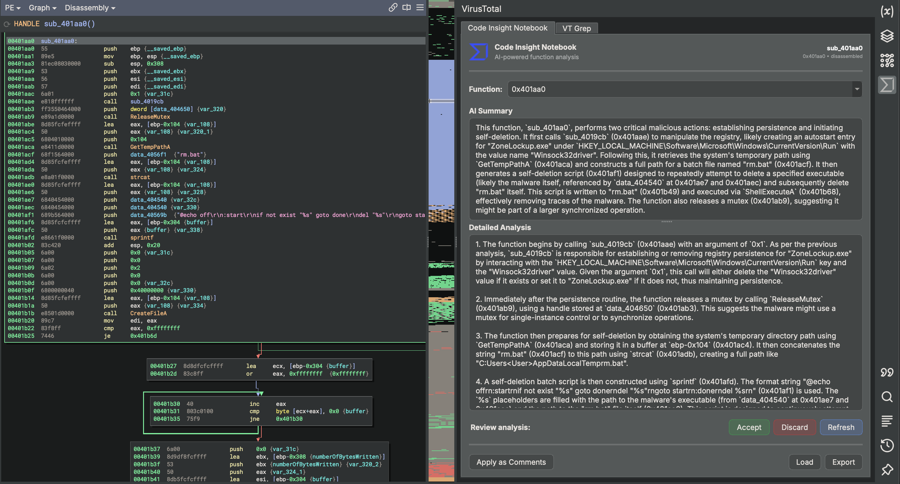
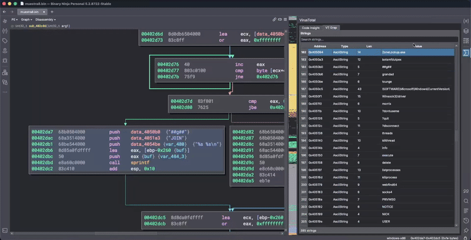
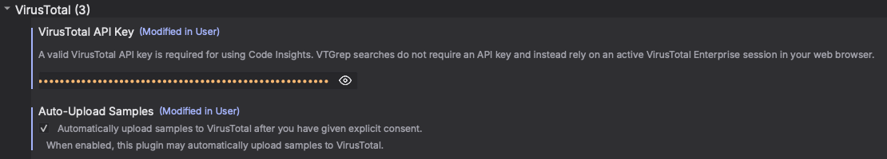

# VirusTotal Plugin for Binary Ninja

An unofficial Binary Ninja plugin that integrates VirusTotal into reverse engineering and malware analysis workflows.

The plugin allows analysts to run VirusTotal searches and AI-assisted Code Insight analysis directly from Binary Ninja, without breaking their analysis flow.

---

## Features

### Code Insight Notebook

The plugin includes a fully integrated **Code Insight Notebook** that brings VirusTotal Code Insight directly into Binary Ninja.

- **AI-assisted analysis**  
  Request summaries and detailed descriptions for functions from disassembly or decompiled views.

- **Persistent notebook**  
  Accepted analyses are stored locally and can be reloaded across Binary Ninja sessions.

- **Editable results**  
  Analysts can review and refine the AI-generated summary and analysis.

- **Apply as Comments**  
  Automatically insert accepted Code Insight summaries as function comments.

- **Import / Export**  
  Save the notebook to JSON or load an existing one to continue analysis across machines or collaborators.

---

### String Search Integration

Strings extracted from the binary can be browsed in a dedicated sidebar and queried directly on VirusTotal with a single click.

---

### Code Similarity & VTGrep

- **Search for bytes**  
  Perform raw byte sequence searches in VirusTotal from the disassembly view.

- **Search for similar code**  
  Search for functionally similar code by wildcarding relocations and offsets before querying VirusTotal.

- **Search for similar functions**  
  Automatically detect function boundaries and search for similar functions without manual selection.

---

> [!NOTE] 
> **VTGrep** searches rely on an active **VirusTotal Enterprise** session in your web browser.
>
> **Code Insight requires a VirusTotal API key** (free, no credit card required).
>
> - **Code Insight** only sends the selected function code for analysis.  
>   The full binary is never uploaded as part of Code Insight requests.
> - **Sample uploads** are optional and only occur if explicitly enabled during the initial consent prompt.

---

## Installation

### Recommended: Plugin Manager

The plugin can be installed directly from the **Binary Ninja Plugin Manager**.

### Manual Installation

1. In Binary Ninja, open the plugins directory.
2. Copy the `vt-binary-ninja-plugin` directory into it.
3. Restart Binary Ninja.

If installing manually, ensure that the `requests` module is available in Binary Ninja’s embedded Python environment.

---

## Configuration

### First-Time Run

On first execution, the plugin will prompt for consent to upload samples that are not already present on VirusTotal.

- **OK**: Enable automatic uploads.
- **No**: Disable automatic uploads.
- **Cancel**: Disable the plugin for the current session.

This setting can be changed at any time from Binary Ninja settings.

---

### API Key Configuration (for Code Insight)

To enable **Code Insight**, configure your VirusTotal API key:

1. Open **Settings**
2. Navigate to **User → VirusTotal**
3. Enter your API key in the `api_key` field
4. (Optional) Adjust automatic upload settings

All preferences are stored in the Binary Ninja user configuration directory.

---

## Acknowledgements

This plugin was inspired in part by the design and workflow of the official VirusTotal IDA Pro plugin.  
Special thanks to Gerardo Fernández (VirusTotal / Google) for the technical discussions that helped shape several of the integration decisions.

## Disclaimer

This is an unofficial, community-maintained plugin and is not affiliated with or endorsed by VirusTotal or Google.
